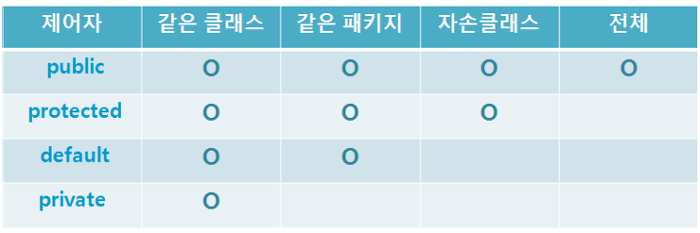

## 1. 상속

### 1.1 상속의 정의와 장점

- 상속이란?
  - 기존의 클래스를 재사용하여 새로운 클래스를 작성하는 것
- 코드의 재사용성을 높이고 코드의 중복을 제거 -> 프로그램의 생산성과 유지보수에 크게 기여
- 조상 클래스
  - 상속해주는 클래스
  - 부모 클래스, 상위 클래스, 기반 클래스
- 자손 클래스
  - 상속 받는 클래스
  - 자식 클래스, 하위 클래스, 파생된 클래스
- 생성자와 초기화 블럭은 상속되지 않는다. 멤버만 상속된다.
- 자손 클래스의 멤버 개수는 조상 클래스보다 항상 같거나 많다.

### 1.2 클래스간의 관계 - 포함관계

### 1.3 클래스간의 관계 결정하기

- '~은 ~이다(is-a)' -> 상속관계
- '~은 ~을 가지고 있다(has-a)' -> 포함관계

### 1.4 단일 상속

### 1.5 Object클래스 - 모든 클래스의 조상

- Object클래스는 모든 클래스 상속계층도의 최상위에 있는 조상클래스이다.

## 2. 오버라이딩(overriding)

### 2.1 오버라이딩이란?

- 조상 클래스로부터 상속받은 메서드의 내용을 변경하는 것

### 2.2 오버라이딩의 조건

- 이름이 같아야 한다.
- 매개변수가 같아야 한다.
- 반환타입이 같아야 한다.
- 1. 접근 제어자는 조상 클래스의 메서드보다 좁은 범위로 변경 할 수 없다.
- 2. 조상 클래스의 메서드보다 많은 수의 예외를 선언할 수 없다.
  - 예외의 개수각 아닌 조건이 중요
- 3. 인스턴스메서드를 static메서드로 또는 그 반대로 변경할 수 없다.

### 2.3 오버로딩 vs. 오버라이딩

- 오버로딩 : 기존에 없는 새로운 메서드를 정의하는 것
- 오버라이딩 : 상속받은 메서드의 내용을 변경하는 것

### 2.4 super

- 자손 클래스에서 조상 클래스로부터 상속받은 멤버를 참조하는데 사용되는 참조변수
- 상속받은 멤버와 자신의 멤버와 이름이 같을 때 super를 붙여 구별

### 2.5 super() - 조상 클래스의 생성자

- 조상 클래스의 생성자를 호출하는데 사용
- Object클래스를 제외한 모든 클래스의 생성자 첫 줄에 생성자.this() 또는 super(), 를 호출해야한다.
- 컴파일러가 자동적으로 'super()'를 생성자의 첫줄에 삽입한다.

## 3. package와 import

### 3.1 패키지(package)

- 클래스의 묶음
- 클래스 또는 인터페이스를 포함시킬 수 있다.
- 서로 관련된 클래스들끼리 그룹 단위로 묶어 놓음으로써 클래스를 효율적으로 관리할 수 있다.
- 클래스가 물리적으로 하나의 클래스파일인 것과 같이 패키지는 물리적으로 하나의 디렉토리이다.

## 4. 제어자(modifier)

### 4.1 제어자란?

- 클래스, 변수 또는 메서드의 선언부에 함께 사용되어 부가적인 의미를 부여
- 접근 제어자 : public, protected, default, private
- 그 외 : static, final, abstract, native, transient, synchronized, volatile, strictfp
- 접근 제어자는 한 번에 하나만 선택

### 4.2 static - 클래스의, 공통적인

### 4.3 final - 마지막의, 변경될 수 없는

### 4.4 abstract - 추상의, 미완성의

### 4.5 접근 제어자(access modifier)

- 멤버 또는 클래스에 사용되며, 해당하는 멤버 또는 클래스를 외부에서 접근하지 못하도록 제한하는 역할을 한다.
  - private : 같은 클래스 내에서만 접근이 가능하다.
  - default : 같은 패키지 내에서만 접근이 가능하다.
  - protected : 같은 패키지 내에서, 그리고 다른 패키지의 자손클래스에서 접근이 가능하다.
  - public : 접근 제한이 전혀 없다.  
    

### 4.6 제어자의 조합

-주의사항

- 1. 메서드에 static과 abstract를 함께 사용할 수 없다.
- 2. 클래스에 abstract와 final을 동시에 사용할 수 없다.
- 3. abstract메서드의 접근 제어자가 private일 수 없다.
- 4. 메서드에 private와 final을 같이 사용할 필요가 없다.

## 5. 다형성

### 5.1 다형성이란?

- 여러 가지 형태를 가질 수 있는 능력
- 조상클래스 타입의 참조변수로 자손클래스의 인스턴스를 참조할 수 있도록 하는 것
- 조상 클래스 타비의 참조변수로 자손 클래스의 인스턴스를 참조하도록 하는 것이 가능하다.
<pre>
조상타입의 참조변수로 자손타입의 인스턴스를 참조할 수 있다.
반대로 자손타입의 참조변수로 조상타입의 인스턴스를 참조할 수는 없다.</pre>

### 5.2 참조변수의 형변환

<pre>
자손타입 -> 조상타입(Up-casting) : 형변환 생략가능
조상타입 -> 자손타입(Down-casting) : 형변환 생략불가
</pre>

- 업캐스팅을 할시에는 실제 인스턴스가 갖고 있는 멤버의 개수보다 적을 것이 분명하기에 생략할 수 있다.
- 다운캐스팅시에는 멤버의 개수가 더 많아지므로 생략을 할 수 없다.
- instanceof연산자를 사용하여 참조변수가 참조하고 있는 실제 인스턴스의 타입을 확인할 수 있다.
- 형변환은 참조변수의 타입을 변환하는 것이지 인스턴스를 변환하는 것은 아니기 때문에 참조변수의 형변환은 인스턴스에 아무런 영향을 미치지 않는다.
- 단지 참조변수의 형변환을 통해서, 참조하고 있는 인스턴스에서 사용할 수 있는 멤버의 범위(개수)를 조절하는 것뿐이다.
- 서로 상속관계에 있는 타입간의 형변환은 양방향으로 자유롭게 수행될 수 있으나, 참조변수가 가리키는 인스턴스의 자손타입으로 형변환은 허용되지 않는다.
- 그래서 참조변수가 가리키는 인스턴스의 타입이 무엇인지 확인하는 것이 중요하다.

### 5.3 instanceof연산자

- 참조변수가 참조하고 있는 인스턴스의 실제 타입을 알아보기 위해 사용한다.
- 왼쪽에는 참조변수, 오른쪽에는 타입(클래스명)이 위치
- 결과로 boolean값인 true 또는 false중에 하나를 반환
- 어떤 타입에 대한 instanceof연산의 결과가 true라는 것은 검사한 타입으로 형변환이 가능하다는 것을 뜻한다.

### 5.4 참조변수와 인스턴스의 연결

- 메서드의 경우 조상 클래스의 메서드를 자손의 클래스에서 오버라이딩한 경우에도 참조변수의 타입에 관계없이 항상 실제 인스턴스의 메서드(오버라이딩된 메서드)가 호출된다.
- 멤버변수의 경우 참조변수의 타입에 따라 달라진다.

### 5.5 매개변수의 다형성

- 참조변수의 다형적인 특징은 메서드의 매개변수에도 적용된다.

### 5.6 여러 종류의 객체를 배열로 다루기

## 6. 추상클래스(abstract class)

### 6.1 추상클래스란?

- 미완성된 클래스
- 상속을 통해서 자손클래스에 의해서만 완성될 수 있다.

### 6.2 추상메서드(abstract method)

- 조상 클래스에서는 선언부만을 작성하고, 주석을 덧붙여 어떤 기능을 수행할 목적으로 작성되었는지 알려 주고, 실제 내용은 비워두는 것이다.
<pre>
/* 주석을 통해 어떤 기능을 수행할 목적으로 작성하였는지 설명한다. */
abstract 리턴타입 메서드이름();
</pre>
- 추상클래스로부터 상속받는 자속클래스는 오버라이딩을 통해 조상인 추상클래스의 추상메서드를 모두 구현해야한다.

### 6.3 추상클래스의 작성

- 추상화 : 클래스간의 공통점을 찾아내서 공통의 조상을 만드는 작업
- 구체화 : 상속을 통해 클래스를 구현, 확장하는 작업

## 7. 인터페이스(interface)

### 7.1 인터페이스란?

- 일종의 추상클래스
- 추상클래스처럼 추상메서드를 갖미나 추상클래스보다 추상화 정도가 높아서 추상클래스와 달리 몸통을 갖춘 일반 메서드 또는 멤버변수를 구성원으로 가질 수 없다.
- 오직 추상메서드와 상수만을 멤버로 갖을 수 있다.

### 7.2 인터페이스의 작성

- 키워드로 class 대신 interface를 사용
- 접근제어자로 public 또는 default 사용

```java
interface 인터페이스이름
  public static final 타입 상수이름 = 값;
  public abstract 메서드이름(매개변수목록)
```
