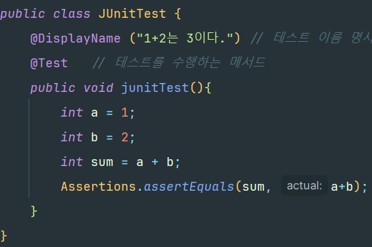
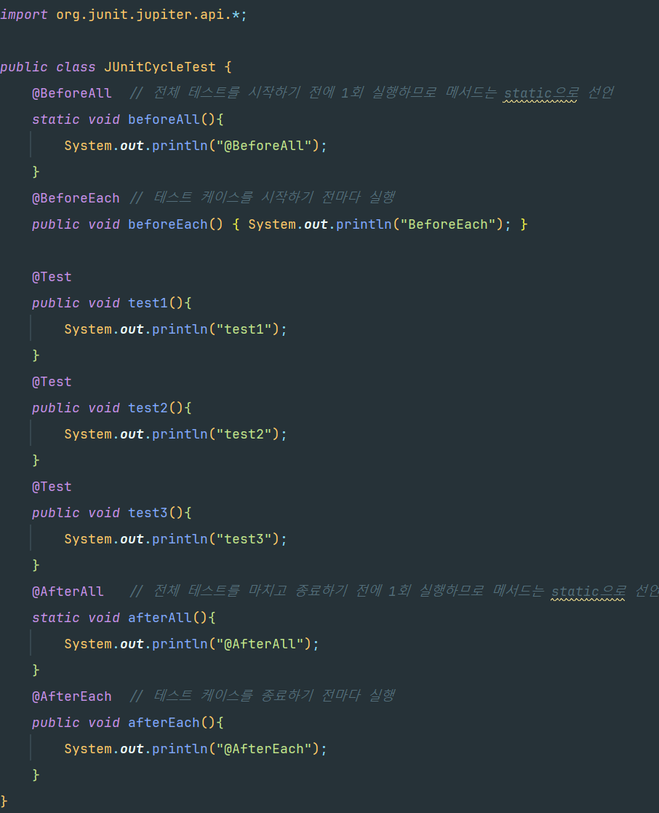

### 테스트 코드란?

- test 디렉터리에서 작업한다.
- given-when-then 패턴을 사용(이 책에서)
  - given : 테스트 실행을 준비하는 단계
  - when : 테스트를 진행하는 단계
  - then : 테스트 결과를 검증하는 단계
- spring-boot-starter-test 스타터에 테스트를 위한 도구가 모여있다.

- 스프링 부트 스타터 테스트 목록
  - **JUnit** : 자바 프로그래밍 언어용 단위 테스트 프레임워크
  - Spring Test & Spring Boot Test : 스프링 부트 애플리케이션을 위한 통합 테스트 지원
  - **AssertJ** : 검증문인 어설션을 작성하는데 사용되는 라이브러리, 등등

### JUnit이란?

- 자바 언어를 위한 단위 테스트 프레임워크이다.
- 단위 테스트란, 작성한 코드가 작동하는지 작은 단위로 검증하는 것을 의미한다.
- JUnit 특징
  - 테스트 방식을 구분할 수 있는 애너테이션 제공
  - @Test 애너테이션으로 메서드를 호출할 때마다 새 인스턴스를 생성, 독립 테스트 가능
  - 예상 결과를 검증하는 어설션 메서드 제공
  - 사용 방법이 단순, 테스트 코드 작성 시간이 적음
  - 자동 실행, 자체 결과를 확인하고 즉각적인 피드백을 제공

- assertEqueals()로 a + b와 sum의 값이 같은지 확인
- asserEquals() -> 첫 번째 인수에는 기대하는 값, 두 번째 인수에는 실제로 검증할 값을 넣는다.

### AssertJ로 검증문 가독성 높이기

- AssertJ는 JUnit과 함께 사용해 검증문의 가독성을 확 높여주는 라이브러리이다.
- Assertions.assertEquals(sum, a+b) -> assertThat(a+b).isEqualTo(sum);

### 핵심 요약

- **테스트 코드**를 작성하면 코드의 기능을 제대로 작동한다는 것을 검증할 수 있다.
- **given** : 테스트를 준비
- **when** : 테스트를 실제로 진행
- **then** : 테스트 결과를 검증
- **JUnit**은 단위 테스트를 할 때 사용하는 자바 테스트 프레임워크이다.
- **AssertJ**는 JUnit과 함께 사용해 검증문의 가독성을 확 높여주는 프레임워크이다.
